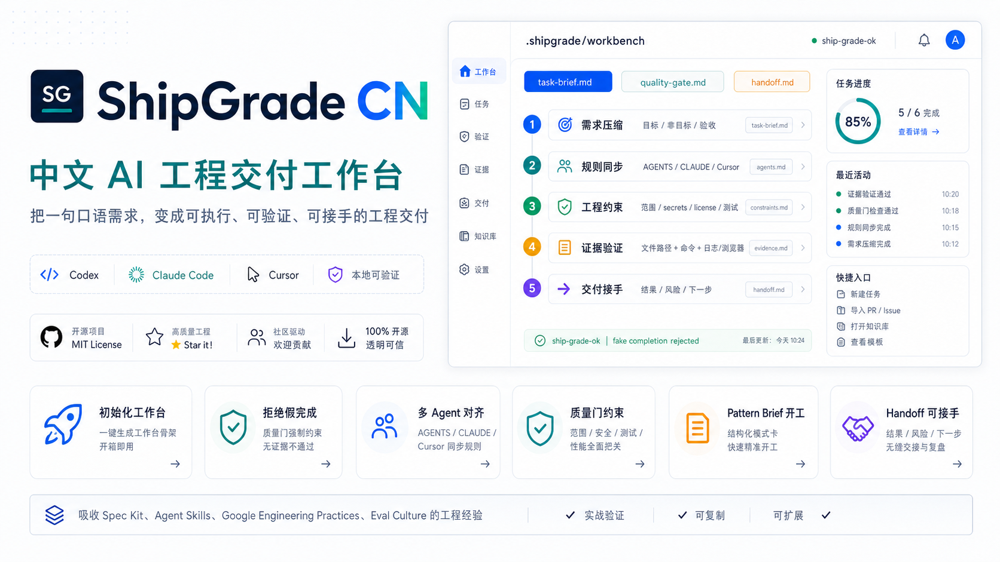

<div align="center">

# ShipGrade CN

**A Chinese-first engineering delivery workbench for Codex, Claude Code, and Cursor.**

[中文](README.md) · [Zero Install](#zero-install-one-md-file) · [Quick Demo](#quick-demo) · [Install](#two-install-paths) · [Evidence Index](docs/EVIDENCE_INDEX.md)

[](#release-preflight)
[](START_HERE.md)
[](LICENSE.md)
[](NOTICE.md)

</div>



## What It Does

ShipGrade CN is a Chinese-first engineering delivery skill for AI coding agents. It is not a prompt pack. It installs repo-local files, quality gates, and verification scripts so Codex, Claude Code, and Cursor can work from the same contract.

Generated workbench:

```text
.shipgrade/task-brief.md   # goal, non-goal, evidence, acceptance
.shipgrade/quality-gate.md # delivery constraints before completion
.shipgrade/handoff.md      # result, proof, risk, next step
AGENTS.md / CLAUDE.md / .cursor/rules/shipgrade.mdc
```

| Problem | What ShipGrade CN adds |
| --- | --- |
| Users should not install anything first | `SHIPGRADE.md` gives a one-file, zero-install rule surface for Codex, Claude Code, Cursor, or any AI coding agent. |
| The request is just "please fix this" | `.shipgrade/task-brief.md`: goal, non-goal, evidence, acceptance criteria, risk boundary, and first slice. |
| Different agents read different rules | `AGENTS.md`, `CLAUDE.md`, and Cursor rules are generated from the same quality gate. |
| The agent says "done" without proof | The MD contract requires proof first; optional `shipgrade_doctor.py` rejects handoffs without artifact paths and command or browser evidence. |
| You want to reuse strong engineering patterns | `shipgrade_patterns.py` turns real-repository Pattern/Task/Eval assets into a task brief. |
| The next agent cannot continue | `.shipgrade/handoff.md` records result, validation proof, residual risk, security boundary, and next action. |
| The repo needs to be public-ready | `github_publish_preflight.py`, `shipgrade_verify.py`, GitHub Actions, and evidence docs check the launch surface. |

## Engineering Constraints

ShipGrade CN gives agents delivery constraints, not tone preferences:

| Constraint | Requirement |
| --- | --- |
| Goal | Define what this task must deliver before implementation starts. |
| Non-goal | Name the modules, data, configs, and refactors that are out of scope. |
| Evidence | Bind completion to file paths, commands, tests, browser checks, logs, or explicit manual checks. |
| Safety | Do not copy secrets, tokens, cookies, sessions, private keys, browser profiles, or private source bodies. |
| Source | Preserve source, license, applicability, and non-applicability when borrowing from public repos. |
| Handoff | Leave enough result, proof, risk, and next-step context for another agent to continue. |

## Why It Is Advanced

| Prompt-pack habit | ShipGrade CN behavior |
| --- | --- |
| Longer instructions inside one chat | A one-file MD contract first; repo-local workbench files only when useful. |
| Trust the model to self-police | The MD contract requires proof; optional `shipgrade_doctor.py` rejects unsupported completion claims. |
| Works only in one agent session | Shared rules for Codex, Claude Code, and Cursor. |
| Hard for beginners to apply | Chinese task briefs turn scope, risk, and acceptance into fillable structure. |
| Hard for senior engineers to trust | Public claims map to evidence files, commands, and validation scripts. |
| Copy surface patterns from famous repos | Convert strong practices into Pattern Briefs, Task Cards, and Evals. |

## What It Borrows From

| Source family | Borrowed idea | ShipGrade CN form |
| --- | --- | --- |
| GitHub Spec Kit / OpenSpec / Agent OS | spec-first, planning, tasks, acceptance gates | task brief + quality gate + pattern brief |
| Addy Osmani Agent Skills / Matt Pocock skills | lifecycle skills, anti-rationalization, command surfaces | cross-agent skill structure |
| Google Engineering Practices | review discipline, maintainability, testing | non-goals, evidence, validation, review boundary |
| Karpathy-style training repos | minimal reproducibility, probes, metrics | demo, verify, release check |
| OpenAI / Anthropic cookbooks | recipes, failure modes, eval thinking | Task Cards, Evals, doctor checks |
| promptfoo / DeepEval | measurable model behavior | script-checkable handoff quality |
| Rust RFC / Kubernetes KEP / OpenTelemetry spec | design docs, compatibility, stage gates | handoff, ADR habits, architecture constraints |

## Problem It Solves

ShipGrade CN is not a prompt pack. It helps Chinese-speaking teams turn everyday requests into a concrete engineering loop:

```text
vague request -> task brief -> smallest change -> validation proof -> handoff -> next agent
```

The delivery contract has six parts:

1. goal
2. non-goal
3. current evidence
4. acceptance criteria
5. validation proof
6. handoff for the next agent or future maintainer

## Zero Install: One MD File

**No Python, no background service, no API key.** The lowest-friction version is the Chinese-first [SHIPGRADE.md](SHIPGRADE.md). Put it in a project or ask Codex, Claude Code, or Cursor to read it.

You can tell an AI coding tool:

```text
Read https://github.com/Alexsun1one/shipgrade-cn/blob/main/SHIPGRADE.md,
wire ShipGrade CN into this project, and use the zero-install path.
Only write the rule file that fits this tool. Do not install Python or start a service.
```

Recommended landing files:

| Tool | File |
| --- | --- |
| Codex | `AGENTS.md` |
| Claude Code | `CLAUDE.md` |
| Cursor | `.cursor/rules/shipgrade.mdc` |
| Generic AI coding agent | project-root `SHIPGRADE.md` |

Python tools are optional enhancers: `shipgrade_init.py` creates the workbench, `shipgrade_doctor.py` checks handoffs, and `github_publish_preflight.py` checks public release readiness. A hosted service is not needed for v1; it only becomes useful later for shared team dashboards, cloud evals, or remote rule sync.

See [docs/zero-install.md](docs/zero-install.md).

Zero install is tested, not just described. The release package runs a maintainer-side proof command that reads `SHIPGRADE.md`, wires `AGENTS.md`, `CLAUDE.md`, and Cursor rules into a temporary project, preserves existing user rules, and does not install Python or start a service in the target project:

```bash
python3 tools/shipgrade_zero_install_demo.py --clean
```

See [docs/ADOPTION_PROOF.md](docs/ADOPTION_PROOF.md).

## Quick Demo

Requirements: Python 3.10+. No API key and no network access are required.

```bash
python3 tools/shipgrade_demo.py
```

The demo proves three things:

- `shipgrade_init.py` creates a project workbench and wires agent rules.
- `shipgrade_doctor.py` rejects a fake completion that only says the work looks done.
- The same doctor accepts a handoff with concrete artifact paths, command evidence, source and license boundaries, security boundaries, and a next-step entry.

Expected signal:

```text
shipgrade-demo-ok
fake_rejection=... ship-grade-fail vague_or_unverified_language ...
accepted=... ship-grade-ok
```

See `docs/DEMO_PROOF.md` for the captured proof.

## Two Install Paths

### Path A: Zero-install MD

Best for first-time users, locked-down company laptops, and Chinese-speaking beginners:

```text
Wire ShipGrade CN into this project using the zero-install path.
Read SHIPGRADE.md from the repo, then write the matching AGENTS.md / CLAUDE.md / Cursor rule.
After that, deliver every task with goal, non-goal, evidence, acceptance, risk, and handoff.
```

### Path B: Python helper tools

Best for maintainers and power users. Requirements: Python 3.10+. No API key and no network access are required.

```bash
python3 tools/shipgrade_init.py /path/to/your-project
cd /path/to/your-project
sed -n '1,160p' .shipgrade/task-brief.md
sed -n '1,160p' AGENTS.md
```

Then use it like this:

1. Fill `.shipgrade/task-brief.md`.
2. Ask Codex, Claude Code, or Cursor to read the project rules.
3. Make the smallest verified change.
4. Write the result and evidence into `.shipgrade/handoff.md`.
5. Run the doctor.

```bash
python3 tools/shipgrade_doctor.py .shipgrade/handoff.md
```

Install as a Codex skill:

```bash
python3 tools/install_skill.py --force
```

## Use A Distilled Pattern

If you are not starting from a blank brief, initialize the project with an engineering pattern distilled from real repositories:

```bash
python3 tools/shipgrade_init.py /path/to/your-project --pattern command_topology_quality_gate
```

Or write the pattern brief into an existing project:

```bash
python3 tools/shipgrade_patterns.py list
python3 tools/shipgrade_patterns.py show command_topology_quality_gate
python3 tools/shipgrade_patterns.py brief command_topology_quality_gate --type engineering_plan --write .shipgrade/pattern-brief.md
```

The generated `pattern-brief.md` is ready for Codex, Claude Code, or Cursor. It contains the scenario, task context, required points, bad-answer patterns, evidence paths, and acceptance criteria.

## Generated Structure

```text
.shipgrade/
  task-brief.md
  pattern-brief.md
  quality-gate.md
  handoff.md
  AGENTS.snippet.md
AGENTS.md
CLAUDE.md
CLAUDE.shipgrade.md
.cursor/rules/shipgrade.mdc
```


## How Different Users Use It

| User | Short path | Advanced path |
| --- | --- | --- |
| Chinese-speaking beginner | Fill `.shipgrade/task-brief.md`, then ask the agent to follow project rules. | Run `shipgrade_doctor.py` before accepting the handoff. |
| Builder | Use ShipGrade as the project workbench for every task. | Start common work from `--pattern` briefs distilled from stronger repositories. |
| Senior reviewer | Review `SKILL.md`, quality gates, evidence docs, licenses, and preflight scripts. | Extend Pattern Cards, Task Cards, and Evals for the team. |


## Source Backbone: Repository Engineering Distillation Pipeline

The distillation process is not the product promise; it is the sourcing discipline behind the skill. ShipGrade CN does not dump repositories into a model and hope it learns architecture. It turns public, license-reviewed repositories into reviewable engineering assets:

```text
Repository -> Engineering Knowledge -> Task Data -> Eval -> RAG / SFT / DPO
```

The output is what matters to users: task briefs, quality gates, doctor checks, pattern briefs, handoffs, and evals. The full method is documented in `docs/repository-engineering-distillation-pipeline.md`.

## Distilled Asset Types

ShipGrade CN turns repository evidence into four reviewable asset types:

| Asset | Purpose |
| --- | --- |
| Repo Card | Repository profile: domain, language, architecture, entrypoints, directories, commands, strengths, and reuse scenarios. |
| Pattern Card | Engineering pattern: scenario, problem, solution, code evidence, benefits, tradeoffs, and migration judgment. |
| Task Card | Task data for planning, review, repair, migration, and anti-pattern recognition. |
| Eval | Evaluation cases with inputs, expected points, deductions, commands, and judge rubrics. |

Current generated assets: 11 Repo Cards / 15 Pattern Cards / 90 Task Cards / 90 Eval Cases. See `docs/repo-engineering-distillation-assets.md` and `docs/evidence/repo_engineering_distillation/`.

## What Is Inside

| Path | Purpose |
| --- | --- |
| `SKILL.md` | The actual skill instructions consumed by agents. |
| `START_HERE.md` | The first navigation file for new users. |
| `tools/shipgrade_init.py` | Generates the project workbench and agent-rule wiring. |
| `tools/shipgrade_zero_install_demo.py` | Proves `SHIPGRADE.md` can wire a target project without Python or a service in that target. |
| `tools/shipgrade_doctor.py` | Checks whether a handoff contains result, validation, source, risk, security, and next-step evidence. |
| `tools/shipgrade_demo.py` | Runs the quick proof path. |
| `tools/shipgrade_patterns.py` | Lists distilled patterns and writes `.shipgrade/pattern-brief.md`. |
| `tools/github_publish_preflight.py` | Checks the repository before release. |
| `docs/repository-engineering-distillation-pipeline.md` | The Repo Card / Pattern Card / Task Card / Eval methodology. |
| `docs/repo-engineering-distillation-assets.md` | Generated Repo/Pattern/Task/Eval assets from real repository evidence. |
| `docs/EVIDENCE_INDEX.md` | Maps public claims to evidence files. |
| `docs/source-depth-dossier.md` | Explains how sources were studied beyond README files. |
| `docs/deep-code-case-studies.md` | Code-level case studies from high-signal repositories. |
| `docs/source-promotion-sandbox-cases.md` | Runtime sandbox evidence for promoted source candidates. |

## Workflow

ShipGrade CN gives agents a repeatable loop:

1. Turn a vague request into a brief.
2. Wire the same rules into Codex, Claude Code, and Cursor.
3. Ship the smallest aligned change.
4. Validate with tests, builds, browser smoke checks, logs, or explicit manual checks.
5. Write a handoff with result, proof, boundaries, residual risk, and next steps.

## Evidence Snapshot

- Sources: 103
- Extracted artifacts: 128
- Repository structure scans: 88
- High-signal source radar: 87 candidates / 64 new / 65 green-license / 8 off-scope search-noise
- Source promotion queue: 87 rows / 12 next deep-sandbox / 18 license-review targets
- Source promotion batch: 4 selected / 4 audited / 2 runtime candidates / 2 static smoke passed (`affaan-m/ECC`, `addyosmani/agent-skills`, `browser-use/browser-use`, `VoltAgent/awesome-agent-skills`)
- Source promotion sandbox cases: 3/3 cases / 13/13 required steps / 264 configured upstream tests (`affaan-m/ECC`, `browser-use/browser-use`, `addyosmani/agent-skills`)
- Deep code case studies: 11 repos / 17649 files / 5381 test paths / 786 eval paths
- Repository engineering distillation assets: 11 Repo Cards / 15 Pattern Cards / 90 Task Cards / 90 Eval Cases
- Evaluation tasks: 12
- Runtime smoke checks: 33 passed checks / 33 checks on 7 cloned repos
- Sandbox runtime matrix: 3/3 cases and 12/12 steps across `Yeachan-Heo/oh-my-claudecode`, `SuperClaude-Org/SuperClaude_Framework`, `github/spec-kit`, with 590 configured upstream tests discovered
- Real project gauntlet: 5/5
- Transcript evidence: 2/2

## Why It Is Not Just Prompts

| Question | Answer |
| --- | --- |
| Can a beginner use it? | Yes. Run `shipgrade_init.py`, fill the brief, then follow the quality gate. |
| Does the agent actually see the rules? | Yes. The initializer wires `AGENTS.md`, `CLAUDE.md`, and Cursor rules. |
| Can it reject fake completion? | Yes. The doctor requires artifact paths and validation evidence. |
| Is the research README-only? | No. It generates 11 Repo Cards / 15 Pattern Cards / 90 Task Cards / 90 Eval Cases. Structure scans cover 88 repositories, and deep code case studies cover 11 repositories. |
| Is there runtime evidence? | Yes. Runtime and sandbox evidence live under `docs/`. |
| Can the repo be released independently? | Yes. It includes local preflight, GitHub Actions, release packaging, issue templates, and license files. |

## How Those Ideas Become Actions

The source influences land as runnable repository artifacts, not decorative citations:

- spec-first practice becomes `.shipgrade/task-brief.md`
- review and test discipline becomes `.shipgrade/quality-gate.md`
- eval thinking becomes `shipgrade_doctor.py`
- multi-agent collaboration becomes shared `AGENTS.md`, `CLAUDE.md`, and Cursor rules
- design-doc stage gates become `.shipgrade/handoff.md`
- strong repository patterns become `tools/shipgrade_patterns.py brief`

## Document Map

- Start here: `START_HERE.md`
- Evidence index: `docs/EVIDENCE_INDEX.md`
- Distillation pipeline: `docs/repository-engineering-distillation-pipeline.md`
- Distillation assets: `docs/repo-engineering-distillation-assets.md`
- Source attribution: `docs/source-attribution.md`
- Deep source study: `docs/source-depth-dossier.md`
- Code case studies: `docs/deep-code-case-studies.md`
- Runtime evidence: `docs/runtime-smoke-evidence.md`, `docs/sandbox-runtime-cases.md`
- Source promotion: `docs/high-signal-source-radar.md`, `docs/source-promotion-queue.md`, `docs/source-promotion-batch.md`
- Release preflight: `docs/GITHUB_PUBLISH_PREFLIGHT.md`
- Demo proof: `docs/DEMO_PROOF.md`
- Roadmap: `docs/ROADMAP.md`

## Release Preflight

```bash
python3 tools/github_publish_preflight.py --write-docs --run-verify
python3 tools/shipgrade_verify.py
python3 scripts/create-public-stage.py /tmp/shipgrade-cn-public
bash scripts/verify.sh
bash scripts/package.sh
```

## Security Boundary

ShipGrade CN must not ingest, train on, or publish:

- secrets, tokens, API keys, or private keys
- cookies, browser profiles, auth databases, or session databases
- private repository bodies
- leaked source, leaked prompts, or archived system prompts
- unclear-license body text

## License

- Code in `tools/`: MIT
- Docs, templates, examples, evals, and skill content: CC BY 4.0
- See `LICENSE.md`, `NOTICE.md`, and `docs/source-attribution.md`
