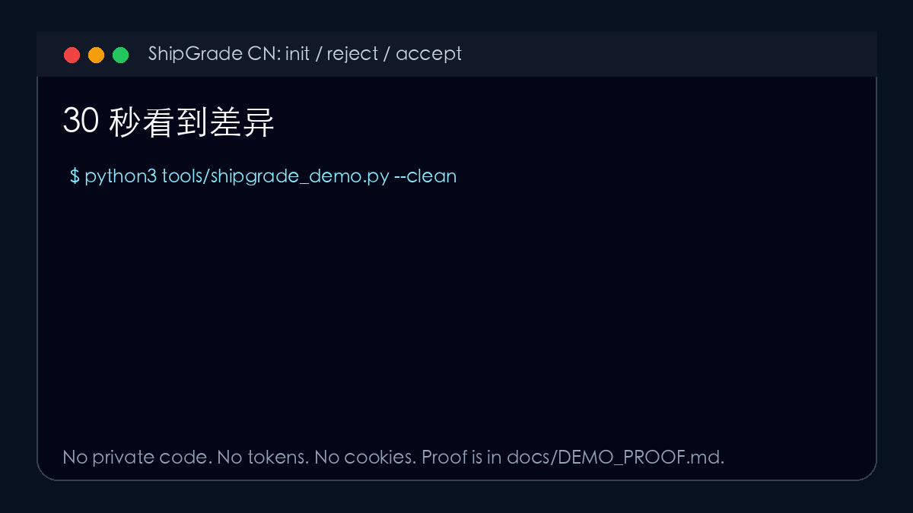
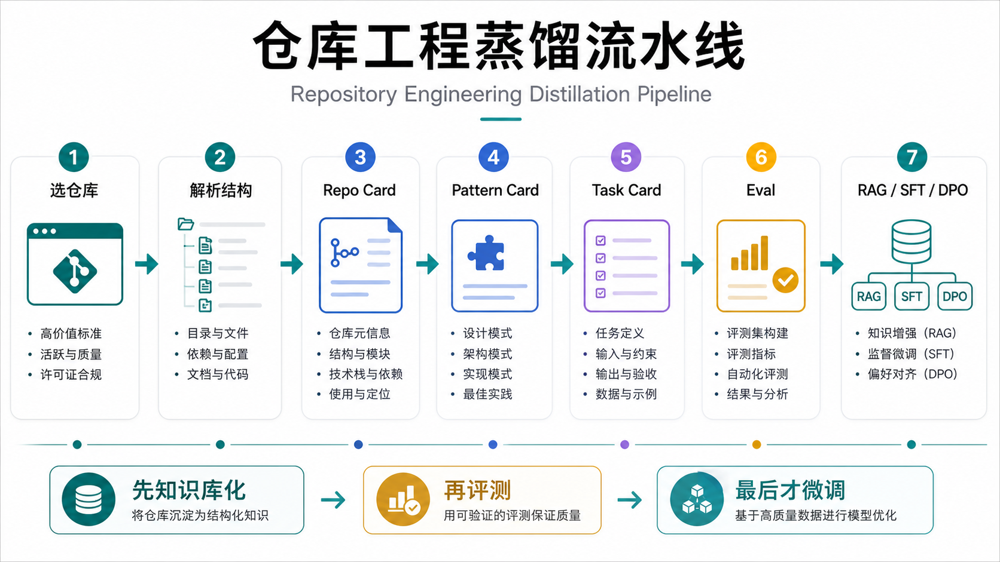
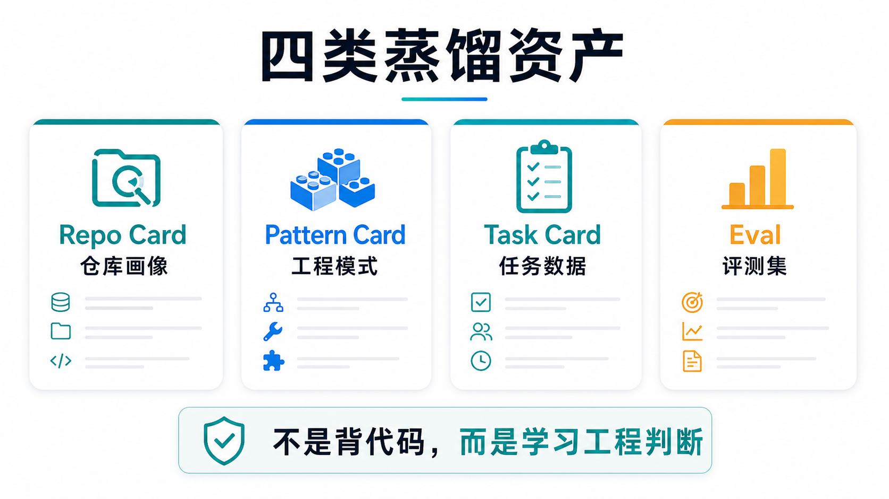

<div align="center">

# ShipGrade CN

**把中文口语需求变成 Codex / Claude Code / Cursor 都能执行、验证、接手的工程交付工作台。**

[English](README.en.md) · [零安装](#零安装只用一个-md-文件) · [外部试用](docs/EXTERNAL_TRIAL_PROOF.md) · [多仓评测](docs/MULTI_REPO_EVAL_PROOF.md) · [真实案例](docs/REAL_ISSUE_CASE_PROOF.md) · [任务套件](docs/REAL_TASK_SUITE_PROOF.md) · [快速开始](#两种接入方式) · [演示证明](docs/DEMO_PROOF.md) · [证据索引](docs/EVIDENCE_INDEX.md)

[](#发布前自检)
[](START_HERE.md)
[](LICENSE.md)
[](NOTICE.md)

</div>


## 它到底是做什么的

ShipGrade CN 是一个面向中文项目的 **AI 工程交付 skill**。它不是“更会哄模型的提示词”,而是把 Codex、Claude Code、Cursor 的工作方式约束成一套可运行的工程契约。

它会在你的项目里生成一套工作台:

```text
.shipgrade/task-brief.md   # 需求、目标、非目标、证据、验收
.shipgrade/quality-gate.md # 交付前必须满足的质量门
.shipgrade/handoff.md      # 结果、验证、风险、下一步
AGENTS.md / CLAUDE.md / .cursor/rules/shipgrade.mdc
```

有了这套工作台,AI 编程助手不再只回答“看起来好了”,而是必须按同一份目标、边界、证据和接手规则交付。

## 它能帮你完成什么

| 场景 | 你得到的能力 |
| --- | --- |
| 零安装接入 | 只用 `SHIPGRADE.md` 这个单文件规则,让 Codex / Claude Code / Cursor 直接读规则开工。 |
| 新项目开工 | 把一句口语需求压成 task brief: 目标、非目标、验收标准、风险边界和第一刀切入点。 |
| 多 Agent 协作 | 同时接入 Codex、Claude Code、Cursor,三个工具读同一套规则,避免各说各话。 |
| 防止假完成 | 默认由规则要求证据;可选 `shipgrade_doctor.py` 会拒绝没有文件路径、命令输出、浏览器证据或日志证据的交付说明。 |
| 复杂任务切入 | `shipgrade_patterns.py` 可以把高信源工程模式写成 `pattern-brief.md`,让 agent 从正确切口开工。 |
| 交付后接手 | `handoff.md` 固定留下结果、验证、剩余风险、安全边界和下一步,下一位 agent 能继续。 |
| 公开发布 | preflight、verify、GitHub Actions、证据索引、许可证边界一起检查,避免 README 只会喊口号。 |

## 工程约束是什么

ShipGrade CN 给 agent 套的不是风格偏好,而是交付约束:

| 约束 | 要求 |
| --- | --- |
| 目标约束 | 先写清楚这次交付什么,不允许边做边重新定义成功。 |
| 非目标约束 | 明确哪些模块、配置、数据、重构这次不碰。 |
| 证据约束 | 结果必须绑定文件路径、命令输出、测试、浏览器检查、日志或人工验收。 |
| 安全约束 | 不复制 secrets、token、cookie、session、私钥、浏览器资料和私有源码正文。 |
| 来源约束 | 借鉴公开仓库时保留许可证、来源、适用场景和不适用边界。 |
| 接手约束 | 每次交付都要留下 handoff,让未来的你或另一个 agent 能继续。 |

## 为什么它先进

| 传统提示词 | ShipGrade CN |
| --- | --- |
| 把要求写得更长 | 先用一个 MD 规则文件让 agent 进入交付闭环,再按需生成项目内文件。 |
| 靠模型自觉 | 规则层先拒绝无证据交付,Python `doctor` 和 preflight 是可选加强。 |
| 一次聊天里有效 | 规则落进 repo,跨 Codex / Claude Code / Cursor 持续生效。 |
| 新手看不懂工程规范 | 中文 brief 把目标、风险、验收拆成能填的结构。 |
| 专业工程师不信口号 | 每个 claim 都能追到公开文档、命令、证据或验证脚本。 |
| 只学某个仓库表面 | 把优秀项目的工作流压成 Pattern Brief / Task Card / Eval,用于开工和审查。 |

## 它吸收了谁的经验

ShipGrade CN 吸收的是工程动作,不是名人光环:

| 来源 | 吸收什么 | 改造成什么 |
| --- | --- | --- |
| GitHub Spec Kit / OpenSpec / Agent OS | spec-first、plan、tasks、验收门 | task brief + quality gate + pattern brief |
| Addy Osmani Agent Skills / Matt Pocock skills | 生命周期 skill、反自嗨检查、可执行命令面 | Codex / Claude / Cursor 通用 skill 结构 |
| Google Engineering Practices | code review、可维护性、测试纪律 | 非目标、证据、测试和 review 边界 |
| Karpathy 风格训练仓库 | 极简可复现、指标、探针 | demo、verify、release check 的最小证明链 |
| OpenAI / Anthropic cookbooks | recipe、失败模式、eval 思维 | Task Card / Eval / doctor 检查项 |
| promptfoo / DeepEval | 把模型质量变成可测对象 | 交付说明可被脚本判定是否合格 |
| Rust RFC / Kubernetes KEP / OpenTelemetry spec | 设计前文档、兼容性、阶段门 | handoff、ADR/决策和架构约束习惯 |

## 它解决什么问题

中文团队真正缺的不是更多“神级提示词”,而是一套能让 AI 编程助手稳定交付的工程契约:

```text
口语需求 -> 任务 brief -> 最小交付 -> 验证证据 -> handoff -> 下一轮可接手
```

ShipGrade CN 会把一次模糊请求压成五件事:

1. 目标: 这次到底要交付什么。
2. 非目标: 哪些东西这次不碰。
3. 证据: 当前有什么文件、日志、截图、命令输出或外部来源。
4. 验收: 什么结果才算完成。
5. 接手: 下一位 agent 或未来的你怎么继续。

## 零安装: 只用一个 MD 文件

**不需要 Python、不需要服务、不需要 API key。** 最低门槛就是把中文优先的 [SHIPGRADE.md](SHIPGRADE.md) 放进你的项目,或让 Codex / Claude Code / Cursor 读取它。

你可以直接对任意 AI 编程工具说:

```text
请读取 https://github.com/Alexsun1one/shipgrade-cn/blob/main/SHIPGRADE.md,
把 ShipGrade CN 接入当前项目,以后按它的工程交付闭环工作。
只需要写入适合本工具的规则文件,不要安装 Python,不要启动服务。
```

工具会按场景写入:

| 工具 | 推荐落点 |
| --- | --- |
| Codex | `AGENTS.md` 或项目已有的 agent 规则文件 |
| Claude Code | `CLAUDE.md` |
| Cursor | `.cursor/rules/shipgrade.mdc` |
| 通用 AI 编程助手 | 项目根目录 `SHIPGRADE.md` |

这个模式适合中文小白和第一次试用: 用户只说“用 ShipGrade 做”,agent 就能按目标、非目标、证据、验收、风险、接手这套结构推进。

## Python 是可选增强,不是使用前提

ShipGrade CN 的 Python 工具只做三件事:

| 可选工具 | 什么时候需要 |
| --- | --- |
| `tools/shipgrade_init.py` | 想一键生成 `.shipgrade/`、`AGENTS.md`、`CLAUDE.md` 和 Cursor 规则。 |
| `tools/shipgrade_doctor.py` | 想用脚本自动拒绝“看起来好了”这种无证据 handoff。 |
| `tools/github_publish_preflight.py` | 想发布公开仓库前跑 README、证据、许可证和安全边界检查。 |

它**不需要做成常驻服务**。只有未来要做团队云端模板库、网页控制台、共享 eval 看板或远程规则同步时,服务才值得出现。当前 v1 最优形态是: **单文件 MD 可用,Python 可增强,服务不介入。**

完整说明见 [docs/zero-install.md](docs/zero-install.md)。

零安装不是口号。发布包会运行一条维护者验证命令,证明一个临时项目只读取 `SHIPGRADE.md` 就能写入 `AGENTS.md`、`CLAUDE.md` 和 Cursor 规则,同时保留已有用户规则、不安装 Python、不启动服务:

```bash
python3 tools/shipgrade_zero_install_demo.py --clean
```

证据见 [docs/ADOPTION_PROOF.md](docs/ADOPTION_PROOF.md)。

为了避免“只在自己造的临时项目里成立”,发布包还跑一个外部小仓试用: 临时 clone `pypa/sampleproject`,只用 `SHIPGRADE.md` 接入规则,写入 `.shipgrade/task-brief.md` 和 `.shipgrade/handoff.md`,运行该仓库已有的 Python 单测,再用 `shipgrade_doctor.py` 审 handoff:

```bash
python3 tools/shipgrade_external_trial.py --clean
```

证据见 [docs/EXTERNAL_TRIAL_PROOF.md](docs/EXTERNAL_TRIAL_PROOF.md)。

更强的一层是多仓评测: 发布包会在 `pypa/sampleproject`、`pallets/click`、`pallets/itsdangerous` 三个许可明确的小型公开仓库里重复同一套流程: `SHIPGRADE.md` 接入、task brief、handoff、仓库原生轻量验证、doctor 审核。

```bash
python3 tools/shipgrade_multi_repo_eval.py --clean
```

证据见 [docs/MULTI_REPO_EVAL_PROOF.md](docs/MULTI_REPO_EVAL_PROOF.md)。

再往前一步是真实仓 issue 式案例: 发布包会临时 clone `pallets/click`,读取真实项目结构,用 ShipGrade 主控规则生成 task brief,写一个聚焦 `click.option(required=True)` 行为的回归检查,运行 `PYTHONPATH=src` 本地验证,再由 doctor 审 handoff。

```bash
python3 tools/shipgrade_real_issue_case.py --clean
```

证据见 [docs/REAL_ISSUE_CASE_PROOF.md](docs/REAL_ISSUE_CASE_PROOF.md)。

再往前一步是多类型真实任务套件: 发布包会在 `pallets/click` 和 `pallets/itsdangerous` 两个真实开源仓里生成并验证 4 类工程任务样本: repair、migration、review、anti-pattern detection。它不是让小模型背代码,而是让 Skill 把真实项目结构转成可训练、可评测、可审计的任务卡和 chosen/rejected 样本。

```bash
python3 tools/shipgrade_real_task_suite.py --clean
```

证据见 [docs/REAL_TASK_SUITE_PROOF.md](docs/REAL_TASK_SUITE_PROOF.md)。

## 30 秒看懂差异

```bash
python3 tools/shipgrade_demo.py
```

你会看到一个完整闭环:

- 初始化一个临时项目。
- 生成 `.shipgrade/` 工作台、`AGENTS.md`、`CLAUDE.md` 和 Cursor 规则。
- 拒绝“看起来好了”的假完成。
- 接受包含文件路径、命令证据、来源边界、安全边界和下一步的合格交付说明。

```text
shipgrade-demo-ok
fake_rejection=... ship-grade-fail vague_or_unverified_language ...
accepted=... ship-grade-ok
```

演示证据在 `docs/DEMO_PROOF.md`,动画在下面这张图里。



## 两种接入方式

### 方式 A: 零安装 MD 模式

适合第一次使用、中文小白、公司电脑不能乱装东西的场景:

```text
请把 ShipGrade CN 接入当前项目。
优先使用零安装模式: 读取仓库里的 SHIPGRADE.md,
把规则写入 AGENTS.md / CLAUDE.md / .cursor/rules/shipgrade.mdc 中适合当前工具的文件。
之后所有任务都按目标、非目标、证据、验收、风险、接手来交付。
```

### 方式 B: Python 一键初始化模式

适合进阶用户和公开仓库维护者。要求: Python 3.10+。不需要 API key,不需要联网。

```bash
python3 tools/shipgrade_init.py /path/to/your-project
cd /path/to/your-project
sed -n '1,160p' .shipgrade/task-brief.md
sed -n '1,160p' AGENTS.md
```

然后按这个顺序用:

1. 在 `.shipgrade/task-brief.md` 填清楚目标、非目标、验收标准和风险边界。
2. 让 Codex、Claude Code 或 Cursor 读取项目规则,按 ShipGrade 流程工作。
3. 交付前把结果写进 `.shipgrade/handoff.md`。
4. 用质量检查器检查交付说明是不是有证据。

```bash
python3 tools/shipgrade_doctor.py .shipgrade/handoff.md
```

如果要装成 Codex skill:

```bash
python3 tools/install_skill.py --force
```

## 用蒸馏出来的模式开工

如果你不是从空白 brief 开始,可以在初始化时直接带一个真实仓库里提炼过的工程模式:

```bash
python3 tools/shipgrade_init.py /path/to/your-project --pattern command_topology_quality_gate
```

或者在已有项目里单独生成模式 brief:

```bash
python3 tools/shipgrade_patterns.py list
python3 tools/shipgrade_patterns.py show command_topology_quality_gate
python3 tools/shipgrade_patterns.py brief command_topology_quality_gate --type engineering_plan --write .shipgrade/pattern-brief.md
```

这会生成一份可交给 Codex、Claude Code 或 Cursor 的 `pattern-brief.md`: 它包含适用场景、任务上下文、应包含点、坏答案、证据路径和验收标准。也就是说,蒸馏资产不是摆在 README 里好看的名词,而是能直接进入项目工作台的输入。

## 它会生成什么

```text
.shipgrade/
  task-brief.md       # 把口语需求压成目标、非目标、证据、验收和第一刀
  pattern-brief.md    # 可选: 从真实仓库蒸馏模式生成的开工 brief
  quality-gate.md     # 每次交付前必须过的质量门
  handoff.md          # 下一位 agent 或未来自己的接手入口
  AGENTS.snippet.md   # 可追加到项目 AGENTS.md 的规则片段
AGENTS.md             # ShipGrade 托管规则块,给 Codex 读
CLAUDE.md             # ShipGrade 托管规则块,给 Claude Code 读
CLAUDE.shipgrade.md   # Claude Code 的独立协作说明
.cursor/rules/shipgrade.mdc
```


## 怎么用: 三类人都能走同一套质量门

| 用户 | 最短路径 | 进阶用法 |
| --- | --- | --- |
| 中文小白 | 先填 `.shipgrade/task-brief.md`,把“我要什么”和“怎样算完成”写清楚。 | 交付前跑 `shipgrade_doctor.py`,避免被“已完成”糊弄。 |
| 进阶用户 | 把 ShipGrade 当成项目工作台,每次开工先 brief,做完写 handoff。 | 给常见任务套用 `--pattern`,让 AI 从高信源工程模式里借力。 |
| 专业工程师 | 直接审 `SKILL.md`、质量门、证据索引、许可证和发布前检查。 | 用 Pattern Card / Task Card / Eval 继续扩展自己的团队规范。 |

## 工作流结构


1. 需求进入: 先把口语需求变成 brief。
2. 规则接线: 让 Codex、Claude Code、Cursor 都看到同一套质量门。
3. 最小交付: 只做当前目标需要的最小正确改动。
4. 证据验证: 用测试、构建、浏览器冒烟检查、日志或人工检查证明结果。
5. 接手沉淀: 写 handoff,保留下一步、风险和验证结果。

## 背后的来源: 仓库工程蒸馏流水线

蒸馏过程不是卖点本身,只是保证这个 skill 不是拍脑袋写出来。ShipGrade CN 不把一堆 repo 直接塞给模型背代码,而是把公开高信源仓库转成可审查的工程资产:

```text
Repo -> 工程知识 -> 任务数据 -> 评测 -> RAG / SFT / DPO
```

重点不是展示“我们蒸馏了什么”,而是把这些经验变成用户能直接用的: task brief、quality gate、doctor、pattern brief、handoff 和 eval。完整方法论见 `docs/repository-engineering-distillation-pipeline.md`。



## 四类蒸馏资产

ShipGrade CN 真正产出的不是代码复制件,而是四类可以被检索、评测、训练和人工审查的工程资产:

| 资产 | 作用 |
| --- | --- |
| Repo Card（仓库画像） | 记录领域、语言、架构、入口、目录、命令、强项和适用迁移场景。 |
| Pattern Card（工程模式卡） | 记录适用场景、问题、解法、证据、优点、代价和迁移判断。 |
| Task Card（任务卡） | 给模型或 AI 编程助手使用的规划、审查、修复、迁移和反模式识别任务。 |
| Eval（评测集） | 记录输入、期望点、扣分点、命令、人工或模型裁判标准。 |

当前生成资产: 11 Repo Cards / 15 Pattern Cards / 90 Task Cards / 90 Eval Cases。详见 `docs/repo-engineering-distillation-assets.md`,公开证据在 `docs/evidence/repo_engineering_distillation/`。



## 里面有什么

| 路径 | 用途 |
| --- | --- |
| `SKILL.md` | AI 编程助手真正会读取的核心技能说明。 |
| `START_HERE.md` | 第一次打开项目时的路线图。 |
| `tools/shipgrade_init.py` | 给任意项目生成 `.shipgrade/`、`AGENTS.md`、`CLAUDE.md` 和 Cursor 规则。 |
| `tools/shipgrade_zero_install_demo.py` | 证明只读 `SHIPGRADE.md` 也能接入项目,不要求目标项目安装 Python 或启动服务。 |
| `tools/shipgrade_external_trial.py` | 在许可明确的小型公开仓库上做零安装试用,生成可被 doctor 审核的外部 handoff。 |
| `tools/shipgrade_multi_repo_eval.py` | 在多个公开小仓重复零安装接入、轻量验证和 doctor 审核,生成可训练/可评测样本候选。 |
| `tools/shipgrade_real_issue_case.py` | 在真实开源仓 `pallets/click` 中跑 issue 式回归验证,证明主控智能、证据矩阵和完成审计能进入真实项目。 |
| `tools/shipgrade_real_task_suite.py` | 在 `pallets/click` 和 `pallets/itsdangerous` 中生成 repair、migration、review、anti-pattern detection 四类真实任务样本。 |
| `tools/shipgrade_doctor.py` | 检查交付说明是否包含结果、验证、来源、风险、安全边界和接手入口。 |
| `tools/shipgrade_demo.py` | 30 秒演示初始化、拒绝假完成、接受合格交付。 |
| `tools/shipgrade_patterns.py` | 查看 Pattern Card,并生成可执行的 `.shipgrade/pattern-brief.md`。 |
| `tools/github_publish_preflight.py` | 发布前检查 README、证据、模板、工作流、图片和安全边界。 |
| `docs/repository-engineering-distillation-pipeline.md` | 仓库画像、工程模式卡、任务卡、评测集的工程蒸馏方法论。 |
| `docs/repo-engineering-distillation-assets.md` | 从真实仓库证据生成的 Repo/Pattern/Task/Eval 资产样例和计数。 |
| `docs/EVIDENCE_INDEX.md` | 所有公开 claim 对应到哪些证据文件。 |
| `docs/source-depth-dossier.md` | 信源不是只看 README,而是看结构、脚本、测试、命令和 agent 入口。 |
| `docs/deep-code-case-studies.md` | 对高信源项目的代码级案例研究。 |
| `docs/source-promotion-sandbox-cases.md` | 候选项目进入临时沙箱后的真实运行记录。 |
| `docs/LAUNCH_COPY.md` | 发布文案和首发说明。 |

## 为什么不是提示词合集

| 问题 | ShipGrade CN 怎么回答 |
| --- | --- |
| 新手能不能用 | 可以。先跑 `shipgrade_init.py`,再填 `.shipgrade/task-brief.md`。 |
| 初始化后 agent 真能看到吗 | 可以。默认接入 `AGENTS.md`、`CLAUDE.md` 和 Cursor rule。 |
| 会不会放过假完成 | 不会只看好听的话。doctor 要求具体产物路径和命令或浏览器证据。 |
| 是不是只抓 README | 不是。已生成 11 Repo Cards / 15 Pattern Cards / 90 Task Cards / 90 Eval Cases,结构扫描覆盖 88 个仓库,代码级案例研究覆盖 11 个仓库。 |
| 有没有真实运行 | 有。临时沙箱记录覆盖 `affaan-m/ECC`、`browser-use/browser-use`、`addyosmani/agent-skills`。 |
| 有没有外部项目试用 | 有。`docs/EXTERNAL_TRIAL_PROOF.md` 记录了 `pypa/sampleproject` 的零安装接入、既有单测和 handoff doctor 审核。 |
| 有没有多轮评测 | 有。`docs/MULTI_REPO_EVAL_PROOF.md` 记录 3 个公开小仓的重复接入、轻量验证和 doctor pass。 |
| 有没有真实 issue 式案例 | 有。`docs/REAL_ISSUE_CASE_PROOF.md` 记录 `pallets/click` 的 CLI 行为回归验证和 handoff doctor 审核。 |
| 有没有多类型任务质量证明 | 有。`docs/REAL_TASK_SUITE_PROOF.md` 记录 repair、migration、review、anti-pattern detection 四类真实开源仓任务样本。 |
| 能不能发布 | 可以。仓库内有发布前检查、GitHub Actions、模板、许可证、发布包和校验脚本。 |

## 证据快照

- 信源总数: 103
- 抽取产物: 128
- 仓库结构扫描: 88
- 高信号信源雷达: 87 candidates / 64 new / 65 green-license / 8 off-scope search-noise
- 信源晋级队列: 87 rows / 12 next deep-sandbox / 18 license-review targets
- 信源批量审计: 4 selected / 4 audited / 2 runtime candidates / 2 static smoke passed (`affaan-m/ECC`, `addyosmani/agent-skills`, `browser-use/browser-use`, `VoltAgent/awesome-agent-skills`)
- 晋级信源沙箱: 3/3 cases / 13/13 required steps / 264 configured upstream tests (`affaan-m/ECC`, `browser-use/browser-use`, `addyosmani/agent-skills`)
- 代码级案例研究: 11 repos / 17649 files / 5381 test paths / 786 eval paths
- 仓库工程蒸馏资产: 11 Repo Cards / 15 Pattern Cards / 90 Task Cards / 90 Eval Cases
- 评测任务: 12
- 运行冒烟检查: 33 passed checks / 33 checks on 7 cloned repos
- 沙箱运行矩阵: 3/3 cases and 12/12 steps across `Yeachan-Heo/oh-my-claudecode`, `SuperClaude-Org/SuperClaude_Framework`, `github/spec-kit`, with 590 configured upstream tests discovered
- 真实项目 gauntlet: 5/5
- 交付记录证据: 2/2
- 外部小仓零安装试用: `pypa/sampleproject` handoff doctor pass
- 多仓外部评测: 3/3 public repos passed zero-install eval
- 真实仓 issue 式案例: `pallets/click` required-option regression case pass
- 多类型真实任务套件: 4/4 real task cases across repair/migration/review/anti-pattern detection
- GitHub 发布前检查: 已内置本地报告

## 这些经验怎么落到动作里

它们最后不会停在 README 里,而是落成可执行文件:

- spec-first 变成 `.shipgrade/task-brief.md`。
- review 和测试纪律变成 `.shipgrade/quality-gate.md`。
- eval 思维变成 `shipgrade_doctor.py` 的合格/不合格判定。
- 多 Agent 协作变成 `AGENTS.md`、`CLAUDE.md`、Cursor rule 的同源规则。
- 设计文档和阶段门变成 `.shipgrade/handoff.md`。
- 高信源工程模式变成 `tools/shipgrade_patterns.py brief`。

## 资料地图

- 快速入口: `START_HERE.md`
- 证据索引: `docs/EVIDENCE_INDEX.md`
- 蒸馏流水线: `docs/repository-engineering-distillation-pipeline.md`
- 蒸馏资产: `docs/repo-engineering-distillation-assets.md`
- 信源地图: `docs/source-attribution.md`
- 深度研究: `docs/source-depth-dossier.md`
- 代码案例: `docs/deep-code-case-studies.md`
- 运行证据: `docs/runtime-smoke-evidence.md`、`docs/sandbox-runtime-cases.md`
- 外部试用: `docs/EXTERNAL_TRIAL_PROOF.md`
- 多仓评测: `docs/MULTI_REPO_EVAL_PROOF.md`
- 真实 issue 案例: `docs/REAL_ISSUE_CASE_PROOF.md`
- 多类型任务套件: `docs/REAL_TASK_SUITE_PROOF.md`
- 晋级队列: `docs/high-signal-source-radar.md`、`docs/source-promotion-queue.md`、`docs/source-promotion-batch.md`
- 发布检查: `docs/GITHUB_PUBLISH_PREFLIGHT.md`
- 演示证明: `docs/DEMO_PROOF.md`
- 路线图: `docs/ROADMAP.md`

## 发布前自检

```bash
python3 tools/github_publish_preflight.py --write-docs --run-verify
python3 tools/shipgrade_verify.py
python3 scripts/create-public-stage.py /tmp/shipgrade-cn-public
bash scripts/verify.sh
bash scripts/package.sh
```

## 安全边界

ShipGrade CN 不接收、不训练、不发布:

- secret、token、API key、private key
- cookie、browser profile、auth database、session database
- 私有仓库正文
- 泄漏源码、泄漏提示词、系统提示词归档
- 许可证不清的正文搬运

## 发布信息

- 推荐仓库名: `shipgrade-cn`
- 推荐描述: `中文工程 skill for Codex / Claude Code / Cursor: turn vague Chinese requests into verifiable engineering delivery.`
- 推荐社交预览图: `assets/shipgrade-hero-cn.png`
- 推荐主题标签: 见 `.github/repo-metadata.json`

## 许可证

- `tools/` 中的代码: MIT
- 文档、模板、示例、评测和 skill 内容: CC BY 4.0
- 详见 `LICENSE.md`、`NOTICE.md`、`docs/source-attribution.md`
