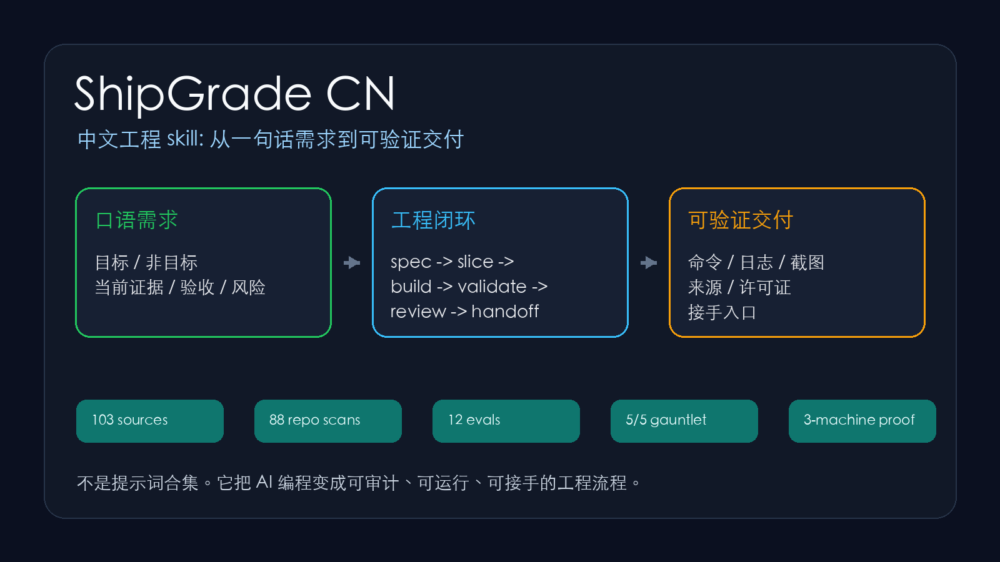
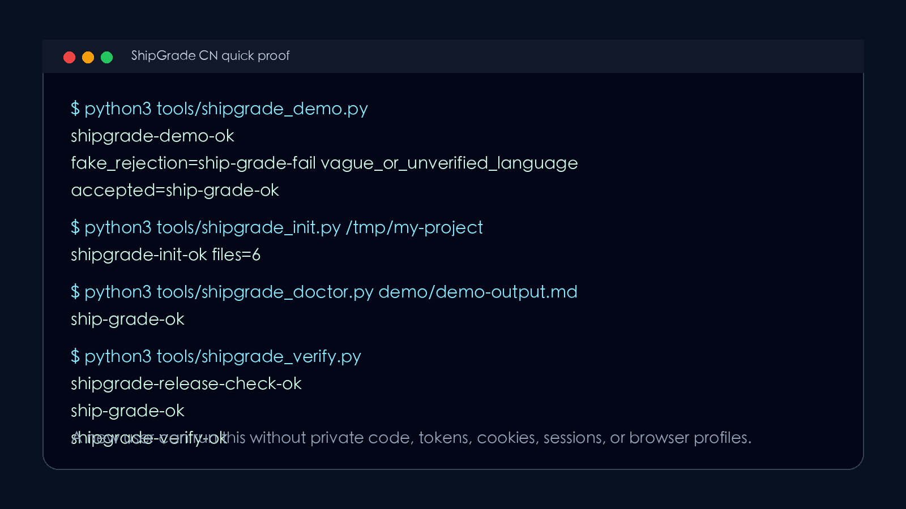

# ShipGrade CN

> 中文工程 skill,让 Codex / Claude Code / Cursor 从“会回答”升级为“能交付、能验证、能接手”。

[](#发布前自检)
[](START_HERE.md)
[](LICENSE.md)
[](NOTICE.md)



**GitHub description**: 中文工程 skill for Codex / Claude Code / Cursor: turn vague Chinese requests into verifiable engineering delivery.

ShipGrade CN 不是提示词合集,也不是英文最佳实践翻译。它是一套给中文团队和 AI agent 用的工程交付系统: 先把口语需求压成可验收任务,再把规则接进 agent,最后用 doctor 拦住假完成。

## 30 秒跑出差异

```bash
python3 tools/shipgrade_demo.py
```

可审计演示记录: `docs/DEMO_PROOF.md`。

你会看到三件事:

- `shipgrade_init.py` 生成 `.shipgrade/` 工作台,并把 `AGENTS.md` / `CLAUDE.md` / Cursor rule 接上线。
- `shipgrade_doctor.py` 拒绝“看起来好了”的假完成。
- 同一个 doctor 接受带文件路径、命令结果、来源许可证和安全边界的合格 handoff。

```text
shipgrade-demo-ok
fake_rejection=... ship-grade-fail vague_or_unverified_language ...
accepted=... ship-grade-ok
```

## 3 分钟上手: 装进你的项目

```bash
python3 tools/shipgrade_init.py /tmp/my-project
sed -n '1,120p' /tmp/my-project/AGENTS.md
python3 tools/shipgrade_verify.py
```

安装到 Codex skills 目录:

```bash
python3 tools/install_skill.py --force
```



## 它解决什么

- 3 分钟把口语需求压成 `.shipgrade/task-brief.md`。
- 自动把 `AGENTS.md` / `CLAUDE.md` / Cursor rule 接上线,让后续 agent 真能看到规则。
- 用 `shipgrade_doctor.py` 拒绝“看起来好了”的假完成,要求命令/浏览器证据。
- 把来源、许可证、安全边界和 handoff 写进产物。
- 把“我做了很多”改成“这里是结果、证据、风险、接手入口”。

## 它会生成什么

```text
.shipgrade/
  task-brief.md       # 目标 / 非目标 / 当前证据 / 验收 / 风险 / 第一刀
  quality-gate.md     # 每次交付前的硬门槛
  handoff.md          # 下一位 agent 或未来自己的接手入口
  AGENTS.snippet.md   # 可追加到项目 AGENTS.md
AGENTS.md             # 默认写入 ShipGrade 托管规则块
CLAUDE.md             # 默认写入 Claude Code 托管规则块
CLAUDE.shipgrade.md
.cursor/rules/shipgrade.mdc
```

## 为什么值得 Star

| 你关心的事 | ShipGrade CN 的回答 |
| --- | --- |
| 小白能不能用 | 跑 `shipgrade_init.py`,填 `.shipgrade/task-brief.md`,按 `quality-gate.md` 验收。 |
| 初始化后会不会真生效 | 会。默认给项目 `AGENTS.md` / `CLAUDE.md` 写入托管规则块,Cursor rule 也生成。 |
| 会不会放过假完成 | 不会只看关键词。doctor 要求具体产物路径和命令/浏览器证据,release check 会验证 fake-pass 被拒绝。 |
| 专业工程师能不能审 | `manifest.json`、`QUALITY_REPORT.md`、`docs/EVIDENCE_INDEX.md`、`docs/source-attribution.md`、`docs/source-depth-dossier.md`、`docs/deep-code-case-studies.md` 都能审。 |
| 是不是只抓 README | 不是。结构扫描覆盖 88 个仓库,并对 11 个 runtime/promotion clone 做 deep code case studies。 |
| 会不会停在旧信源 | 不会。`docs/high-signal-source-radar.md` 用 GitHub 搜索和候选元数据维护新信源池,并把 license review、off-scope 噪声和 sandbox 优先级分开。 |
| 发现后怎么行动 | `docs/source-promotion-queue.md` 把候选分成 next deep/sandbox、manual license review、metadata-only watchlist 和 off-scope search noise。 |
| 拉下来以后有没有审 | `docs/source-promotion-batch.md` 对前排候选做 license probe、sparse clone、结构计数、命令拓扑和安全静态 smoke。 |
| 真的跑了没有 | `docs/source-promotion-sandbox-cases.md` 把 `affaan-m/ECC` 和 `browser-use/browser-use` 放进无密钥临时沙箱,安装依赖并跑代表性上游测试。 |
| 有没有真实运行证据 | 有。`docs/transcript-evidence.md`、`docs/runtime-smoke-evidence.md`、`docs/sandbox-runtime-cases.md` 和 `docs/real-project-gauntlet.md` 保留脱敏执行证据。 |
| 发 GitHub 前怎么把关 | `docs/GITHUB_PUBLISH_PREFLIGHT.md` 和 `tools/github_publish_preflight.py` 会检查 README、workflow、repo metadata、issue/PR 模板、证据 manifest、social preview 和安全边界。 |
| 能不能独立发布 | 能。`.github/workflows/validate.yml` 跑 standalone release check。 |

## 证据快照

- Sources: 103
- Extracted artifacts: 128
- Repo structure scans: 88
- High-signal source radar: 87 candidates / 64 new / 65 green-license / 8 off-scope search-noise
- Source promotion queue: 87 rows / 12 next deep-sandbox / 18 license-review targets
- Source promotion batch: 4 selected / 4 audited / 2 runtime candidates / 2 static smoke passed (`affaan-m/ECC`, `addyosmani/agent-skills`, `browser-use/browser-use`, `VoltAgent/awesome-agent-skills`)
- Source promotion sandbox cases: 2/2 cases / 9/9 required steps / 225 configured upstream tests (`affaan-m/ECC`, `browser-use/browser-use`)
- Deep code case studies: 11 repos / 17649 files / 5381 test paths / 786 eval paths
- Eval tasks: 12
- Runtime smoke checks: 33 passed checks / 33 checks on 7 cloned repos
- Sandbox runtime matrix: 3/3 cases and 12/12 steps across `Yeachan-Heo/oh-my-claudecode`, `SuperClaude-Org/SuperClaude_Framework`, `github/spec-kit`, with 590 configured upstream tests discovered
- Real project gauntlet: 5/5
- Transcript evidence: 2/2
- GitHub publish preflight: local report included
- Release readiness: license / notice / security / contributing / GitHub workflow file / issue templates / PR template / installer / release check

## 给谁用

- 中文小白: 不懂 agent 工程也能把需求交给 AI 正确开工。
- 进阶用户: 建立 spec -> build -> validate -> review -> handoff 的肌肉记忆。
- 专业工程师: 把 AI 协作规则放进可审计、可运行、可维护的工程边界。

## 吸收了谁

ShipGrade CN 吸收的是强工程项目的结构,不是名人光环:

- Karpathy 系列训练仓库: 极简、可复现、指标和探针。
- Google engineering practices/styleguide: review、可维护性、团队一致性。
- GitHub Spec Kit / OpenSpec / Agent OS: spec-first、任务化、验收化。
- Matt Pocock skills: 面向真实工程师的 skill 组织方式。
- OpenAI/Anthropic cookbooks: recipe、eval、失败模式。
- promptfoo / DeepEval: 把 LLM 质量变成可评测对象。
- Cline / Gemini CLI / opencode / Continue / browser-use: 真实 agent 产品工作流。
- Microsoft playbook / Rust RFCs / Kubernetes KEPs / OpenTelemetry spec: 设计前文档和阶段门。

详细见:

- `docs/influence-map.md`
- `docs/EVIDENCE_INDEX.md`
- `docs/source-depth-dossier.md`
- `docs/high-signal-source-radar.md`
- `docs/source-promotion-queue.md`
- `docs/source-promotion-batch.md`
- `docs/source-promotion-sandbox-cases.md`
- `docs/deep-code-case-studies.md`
- `docs/runtime-smoke-evidence.md`
- `docs/sandbox-runtime-cases.md`
- `docs/source-attribution.md`
- `docs/transcript-evidence.md`
- `docs/LAUNCH_COPY.md`
- `docs/DEMO_SCRIPT.md`
- `docs/DEMO_PROOF.md`
- `docs/GITHUB_PUBLISH_PREFLIGHT.md`
- `docs/ROADMAP.md`
- `docs/GOOD_FIRST_ISSUES.md`

## 安全边界

ShipGrade CN 不接收、不训练、不发布:

- secret / token / API key / private key
- cookie / browser profile / auth database / session database
- 私有仓库正文
- 泄漏源码、泄漏提示词、系统提示词归档
- 许可证不清的正文搬运

## 发布前自检

```bash
python3 tools/github_publish_preflight.py --write-docs --run-verify
python3 tools/shipgrade_verify.py
python3 scripts/create-public-stage.py /tmp/shipgrade-cn-public
bash scripts/verify.sh
bash scripts/package.sh
```

## GitHub 发布信息

- Suggested repo: `shipgrade-cn`
- Suggested description: `中文工程 skill for Codex / Claude Code / Cursor: turn vague Chinese requests into verifiable engineering delivery.`
- Suggested social preview: `assets/shipgrade-loop.png`
- Suggested topics: see `.github/repo-metadata.json`

## License

- Code in `tools/`: MIT
- Docs, templates, examples, evals, skill content: CC BY 4.0
- See `LICENSE.md`, `NOTICE.md`, and `docs/source-attribution.md`.
